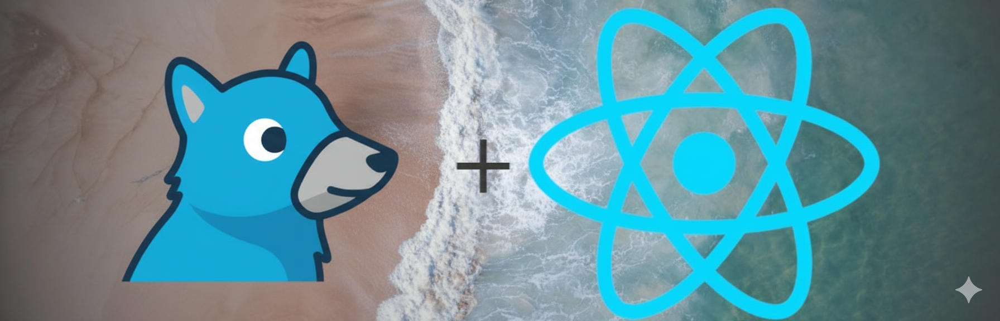

# TweetMind AI++

`Go+React`
  
This project is a full-stack web application designed to analyze a user's personality based on their social media activity, specifically through their tweets. The backend is developed in Go (Golang), ensuring high performance, concurrency, and efficient handling of API requests. The frontend is built with React, providing a dynamic and responsive user interface for users to interact with.

The core functionality involves fetching a user's tweets, processing the textual data, and applying analysis algorithms to extract insights into their personality traits. This project demonstrates the integration of modern web technologies with data analysis techniques, offering both a practical and engaging user experience.

  

## <_The analysis is built upon the following aspects_>

- Thinking Patterns: The way the user processes information and makes decisions.

- Emotional State: Insights into the user's current mood or emotional tendencies.

- Self-Confidence Level: Assessment of the user's confidence and self-perception.

- Communication Style: How the user expresses themselves and interacts with others.

- Potential Motivations: Underlying drives or goals influencing the user's behavior.

- Observed Defense Mechanisms: Psychological strategies the user might employ to cope with stress.

- Possible Behavioral Risks: Actions or tendencies that could pose risks in social or personal contexts.

- Linguistic Cues: Patterns in language usage that reveal personality traits.

- Recommendations: Suggestions for personal growth or behavioral improvement.

- Estimated Age Range: Approximate age inferred from communication style and content.

- Psychological Label: A summary descriptor based on recognized psychological frameworks.

### <_Secure Personality Analysis from Tweets_>

This project analyzes a user's personality safely by fetching tweets through [Nitter](https://nitter.net/), a privacy-focused Twitter alternative. All data retrieval is handled securely, without exposing user credentials or personal information.
  

## <_Oops Daily Usage Limits😊_>

Daily usage limits apply to each account to ensure stable performance of the AI analysis

`"dailyCount": count + 1`

  

## <_Immersive 3D Space Background_>

The chat interface features a 3D model background inspired by space, with dynamic camera movement to create an immersive and visually engaging experience [Avatar3D.js](src/Avatar3D.js).

[Tv_man](https://sketchfab.com/3d-models/tv-man-animation-7699139638a247ce9d061f38e8ec7cc8)

  
If you encounter any issues or have suggestions for the project, feel free to let me know.

[Send a message ](https://github.com/vuvvvv/TweetMind-AI/issues/new)

[@vuvvvv](https://github.com/vuvvvv)

<!-- 🔹 Meta SEO -->
<meta charset="UTF-8">
<meta name="viewport" content="width=device-width, initial-scale=1.0">
<meta name="description" content="حلل تغريداتك أو تغريدات الآخرين بسهولة باستخدام TweetMind AI - أداة ذكاء اصطناعي لفهم النغمة والمشاعر والمغزى من التغريدات.">
<meta name="keywords" content="تحليل تغريدات, ذكاء اصطناعي, تحليل تويتر, TweetMind, tweet analysis, AI">
<meta name="author" content="TweetMind Team">
<meta name="robots" content="index, follow">

<!-- 🔹 Open Graph (Facebook, WhatsApp, LinkedIn) -->
<meta property="og:title" content="TweetMind AI - تحليل التغريدات بالذكاء الاصطناعي">
<meta property="og:description" content="حلل التغريدات واكتشف نغمتها ومحتواها العاطفي باستخدام الذكاء الاصطناعي.">
<meta property="og:image" content="img/1.jpg">
<meta property="og:url" content="https://vuvvvv.github.io/TweetMind-AI/">
<meta property="og:type" content="website">
<meta property="og:site_name" content="TweetMind AI">

<!-- 🔹 Twitter Cards -->
<meta name="twitter:card" content="summary_large_image">
<meta name="twitter:title" content="TweetMind AI - تحليل التغريدات بالذكاء الاصطناعي">
<meta name="twitter:description" content="حلل التغريدات واكتشف محتواها العاطفي والنغمة باستخدام الذكاء الاصطناعي بسهولة.">
<meta name="twitter:image" content="img/1.jpg">

<!-- 🔹 Favicon & Theme -->
<link rel="icon" type="image/png" sizes="32x32" href="img/1.jpg">
<link rel="icon" type="image/png" sizes="16x16" href="img/1.jpg">
<meta name="theme-color" content="#0d0d0d">
